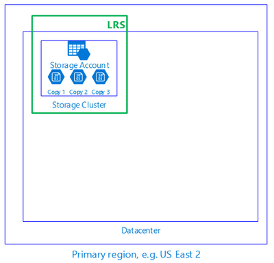
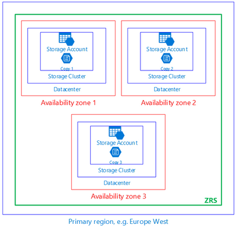

# Azure Storage Redundancy

Azure Storage always stores multiple copies of your data so that it's protected from planned and unplanned events, including transient hardware failures, network or power outages, and massive natural disasters. 

**Redundancy** ensures that your storage account meets its availability and durability targets even in the face of failures.

The services that comprise Azure Storage are managed through a common Azure resource called a **Storage Account**. 

The storage account represents a shared pool of storage that can be used to deploy storage resources such as:
- Blob Containers (Blob Storage)
- File Shares (Azure Files)
- Tables (Table Storage)
- Queues (Queue Storage) 

## Redundancy in the primary region

Data in an Azure Storage account is **always replicated three times in the primary region**. 

Azure Storage offers two options for how your data is replicated in the primary region:
- **Locally redundant storage (LRS)** copies your data synchronously three times within a single physical location in the primary region. 
- **Zone redundant storage (ZRS)** copies your data synchronously across three Azure availability zones in the primary region. 

LRS is the least expensive replication option, but isn't recommended for applications requiring high availability or durability. Microsoft recommends using ZRS in the primary region.

## Redundancy in a secondary region

For applications requiring high durability, you can choose to additionally copy the data in your storage account to a secondary region that is hundreds of miles away from the primary region. 

When you create a storage account, you select the primary region for the account. The paired secondary region is determined based on the primary region, and can't be changed. 

Azure Storage offers two options for copying your data to a secondary region:
- **Geo-redundant storage (GRS)**
- **Geo-zone-redundant storage (GZRS)**

The primary difference between GRS and GZRS is how data is replicated in the primary region. **Within the secondary region, data is always replicated synchronously three times using LRS**. 

With GRS or GZRS, the data in the secondary region isn't available for read or write access unless there's a failover to the primary region. For read access to the secondary region, configure your storage account to use read-access geo-redundant storage (RA-GRS) or read-access geo-zone-redundant storage (RA-GZRS). 