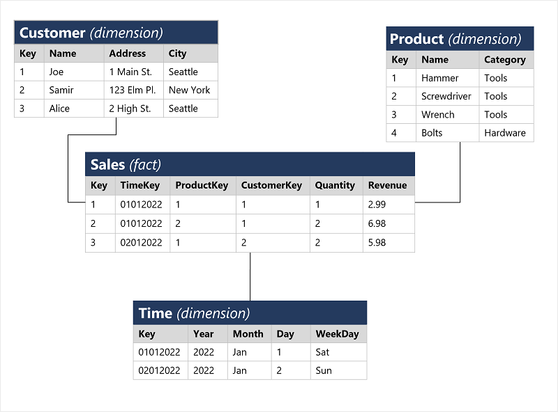
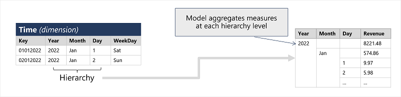

# Core concepts of data modeling

Analytical models enable you to structure data to support analysis. 

Models are based on related tables of data and define the numeric values that you want to analyze or report (known as *measures*) and the entities by which you want to aggregate them (known as *dimensions*). 

Conceptually, the model forms a **multidimensional structure**, which is commonly referred to as a *cube*, in which any point where the dimensions intersect represents an aggregated measure for those dimensions.

    We commonly refer to an analytical model as a cube, there can be more (or fewer) than three dimensions!

## Table and schemas

**Dimension tables** represent the entities by which you want to aggregate numeric measures. Each entity is represented by a row with a unique key value. The remaining columns represent attributes of an entity. It’s common in most analytical models to include a **date dimension** so that you can aggregate numeric measures associated with events over time.

The numeric measures that will be aggregated by the various dimensions in the model are stored in **fact tables**. Each row in a fact table represents a recorded event that has numeric measures associated with it. 

This type of schema, where a fact table is related to one or more dimension tables, is referred to as a **star schema**. 

A more complex schema in which dimension tables are related to additional tables containing more details is referred to as a **snowflake schema**. 

## Attribute hierarchies

One thing worth considering about analytical models is the creation of **attribute hierarchies** that enable you to quickly drill-up or drill-down to find aggregated values at different levels in a hierarchical dimension.

The model can be built with pre-aggregated values for each level of a hierarchy, enabling you to quickly change the scope of your analysis.

