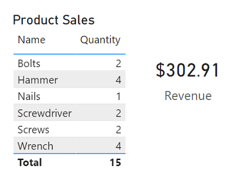
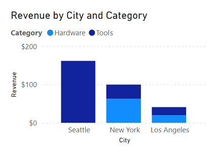
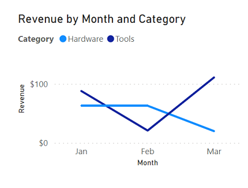
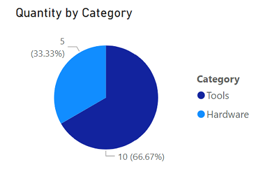
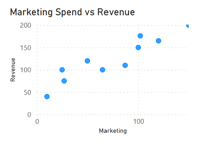

# Considerations for data visualization

Power BI includes an extensive set of built-in visualizations, which can be extended with custom and third-party visualizations.

In Power BI, the visual elements for related data in a report are automatically linked to one another and provide interactivity.

## Tables and text

Tables and text are often the simplest way to communicate data. Tables are useful when numerous related values must be displayed, and individual text values in cards can be a useful way to show important figures or metrics.

## Bar and column charts

Bar and column charts are a good way to visually compare numeric values for discrete categories.

## Line charts

Line charts can also be used to compare categorized values and are useful when you need to examine trends, often over time.

## Pie and doughnut charts

Pie and doughnut charts are often used in business reports to visually compare categorized values as proportions of a total. 

These charts are best suited when comparing a few categories only. When you have more than eight categories, reading and interpreting becomes quite difficult.

## Scatter plots

Scatter plots are useful when you want to compare two numeric measures and identify a relationship or correlation between them.

## Key influencers charts

Key influencers charts allow you to understand the factors that affect a key metric.